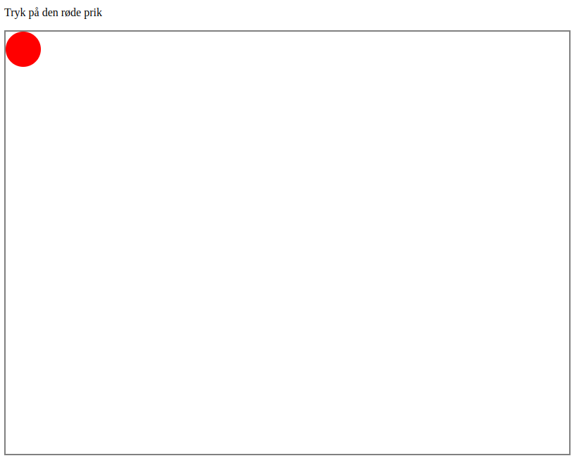

# Den Røde Prik - The Red Dot

I den her demo skal man trykke på den røde prik.
_Desværre_ har jeg sat en event handler til at opfange at musen kører ind over, og så flytter handler ren prikken. Men hvis man holder Control [ctrl] nede mens man kører ind over prikken, så bliver den stående.

## Vejledning

Læs [vejledningen](Vejledning.md) 

## Kilder

* <https://www.w3schools.com/howto/howto_css_circles.asp>
* <https://developer.mozilla.org/en-US/docs/Web/JavaScript/Reference/Global_Objects/Math/random>
* <https://www.w3schools.com/js/js_htmldom_events.asp>