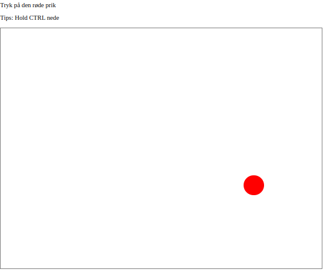
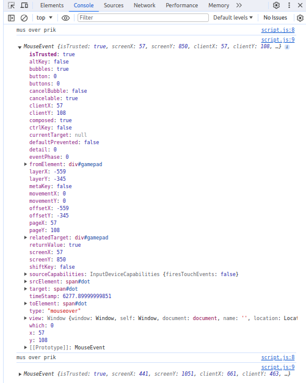

# Den Røde prik

Demo-projekt hvor browserens html-Dom bruges sammen med events fra javascript.

Et simpelt "spil", hvor brugeren skal klikke med musen på en rød prik.

- [Den Røde prik](#den-røde-prik)
  - [Sådan virker det:](#sådan-virker-det)
    - [Elementer, events og eventhandlere](#elementer-events-og-eventhandlere)
    - [Vent på at siden er færdig med at loade](#vent-på-at-siden-er-færdig-med-at-loade)
    - [Når musen kommer ind over prikken](#når-musen-kommer-ind-over-prikken)
      - [Psudokode](#psudokode)
      - [Punkt 1. debug info](#punkt-1-debug-info)
      - [Punkt 2. Udregn nye koordinater](#punkt-2-udregn-nye-koordinater)
      - [Punkt 3. giv de nye koordinater, så prikken flytter sig](#punkt-3-giv-de-nye-koordinater-så-prikken-flytter-sig)
      - [Punkt 4. vis et lille tip til brugeren, som ellers bliver frustreret](#punkt-4-vis-et-lille-tip-til-brugeren-som-ellers-bliver-frustreret)
      - [Punkt 5. sørg for at prikken kan klikkes, hold CTRL-knappen.](#punkt-5-sørg-for-at-prikken-kan-klikkes-hold-ctrl-knappen)
      - [`dotMouseOver` samlet](#dotmouseover-samlet)
    - [Når det (endelig) lykkes at trykke på prikken](#når-det-endelig-lykkes-at-trykke-på-prikken)
  - [Hele kilde koden](#hele-kilde-koden)
    - [red\_dot\_pad.html](#red_dot_padhtml)
    - [style.css](#stylecss)
    - [script.js](#scriptjs)
  - [Andre kilder](#andre-kilder)


Det er bare ikke så let, for jeg har programmeret en eventhandler på prikkens `onmouseover`. Så snart musen kommer ind over prikken, ændres dens position til en anden, og så kan man ikke klikke på den.  
Heldigvis har jeg også lavet det sådan at hvis man holder CTRL nede, så flytter prikken sig ikke.

## Sådan virker det:

### Elementer, events og eventhandlere

Først skal man have fat i det _element_ der skal have _event-handleren_.  
* Et _element_ svarer til et `html-tag`, når det er indlæst i browseren.   
* En _event-handler_ er en funktion der skal udføres når en bestent handling sker, f.eks. når musen bevæges ind over et element.


```javascript
dotElement = document.getElementById('dot');
```

Her hentes et element med id `dot`. Som man kan se i udsnittet af `html`-koden herunder, det netop det element vi skal bruge:


```html
<div id="gamepad">
    <span id="dot"></span>
</div>
```

_Bemærk_ at `span`-tagget er stylet til at være en prik i `style-sheetet`:  
Egentlig er det bare for `span`et er tomt, og har en `border-radius` på 50%.  Altså runde hjørner, ... så giver runder hjørner helevejen rundt om igen ting, en cirkel.

```CSS
#dot {
    height: 50px;
    width: 50px;
    background-color: red;
    border-radius: 50%;
    display: inline-block;
    position:absolute;
  }
```

Vi har altså et `span`-tag, der style su det ligner en prik. Tag bliver fortolket til et element, vi nu har som variablen `dotElement` i _javascript_-koden.  
Nu skal den have en eventhandler.


```javascript
dotElement.onmouseover = dotMouseOver;
```

Elementet `dotElement`, er et objekt med en masse metoder og attributter. En af dem er `onmouseover`. 
Vi kan ændre hvilken funktion der udføres når eventet sker (musen kommer ind over elementet). Her vil vi gerne have at vores funktion `dotMouseOver`, som defineres om lidt.

### Vent på at siden er færdig med at loade

Inden vi kan give _eventhandlere_ til elementer, skal vi lige være sikker på at alt `html`, `css` og `javascript` er indlæst. Heldigvis har browserens `window` object et event som sker nåe siden er indlæst: `.onload`. Så vi samler alt den kode der sætter eventhandlere i en funktion vi giver til `window.onload`.

```javascript
window.onload = function(event) {
    dotElement = document.getElementById('dot');
    dotElement.onmouseover = dotMouseOver;
    dotElement.onclick = dotClick;
}
```

Hvis vi ikke sørger for at vente, til siden er loaded, kan browseren ikke finde noget element med "id=='dot'". Det handler om at javascriptet bliver startet inde browseren er færdig med at analysere `html`-delen.

### Når musen kommer ind over prikken

```javascript
function dotMouseOver(event) {
...
}
```

#### Psudokode
Det jeg gerne vil i funktionen er:
1. vis noget (debug) info
2. udregn nye koordinater til prikken
3. giv de nye koordinater, så prikken flytter sig
4. vis et lille tip til brugeren, som ellers bliver frustreret
5. sørg for at prikken kan klikkes, hold CTRL-knappen.

#### Punkt 1. debug info
Vi laver en funktion `dotMouseOver`. Ovenfor er den defineret til at være handler for `onmouseover` for prikkens element.

Først sørger jeg for at få noget debug information.

```javascript
function dotMouseOver(event) {
    console.log('mus over prik')
    console.log(event);
...
}
```

Dermed får jeg info i browserens console vindue, som hjælper mig med beslutte hvad jeg mere skal gøre, og om jeg er på rette spor

Så snart jeg kører musen over den røde prik, 



Så kan se dette i console:  
  
Min kommando skriver "mus over prik", og derefter kommer hele `mouseevent` variablen.

#### Punkt 2. Udregn nye koordinater

```javascript
  x = Math.floor(Math.random() * (800-50));
  y = Math.floor(Math.random() * (600-50));
```

Jeg bruger `random()` fra `Math` klassen.  Metoden `random()` giver et tilfældigt tal mellem 0 og 1. Men jeg vil gerne have større, hele tal, inden for div boxens (`<div id="gamepad">`) størrelse. I `style.css` kan vi se at dens stærrelse er:

```css
  #gamepad {
    width: 800px;
    height: 600px;
...
  }
```

Så for at få det nye x koordinat mellem 0 og 800, ganger jeg det tilfældige til med 800.  
Så er der bare lige det at koordinatet vi sætter er prikkens øverste venstre hjørne, så hvis det nye x-koordinat er 800, ligger prikken uden for boksen. Så jeg trækker lige prikken bredde (50), fra de 800.  
Nogenlunde det sammen med y koordinatet, bare sådan at y kan være maks 600, boksens højde.

Her har jeg "hardcoded" størrelserne (`50`, `600` og `800`). Så hvis man ændrer styelsheetet, skal man manuelt rette javascript koden også. Alternativt kunne disse værdier hentes fra elementerne i dom'en, men for at holde eksemplet simpelt, har jeg bare skrevet allene ind.

#### Punkt 3. giv de nye koordinater, så prikken flytter sig

Vi skal flytte prikken. Prikkens placering på websiden er bestemt af den styelsheet. Selve prikken dom-element har vi ikke i en varibel i `dotMouseOver` funktionen. Vi kunne finde den med `document.getElementById()`, men jeg vil gerne have at funktionen kan virke for andre elmenter, fekst hvis der var to prikker, eller andet. Derfor henter vi prikkens element fra den parameter __*browseren*__ sørger for at eventhandleren får når eventet sker (det er defineret i browser-manualen [link]()). Parameteren `event` har attributeten; `target`, som er den ting musen er kørt hen over. 

```javascript
  event.target ...
```

Attributen `target` har en anden attribut `style`, som igen attributterne `top` og `left`.  

```javascript
  event.target.style.top = ...
  event.target.style.left = ...
```

Men det er _css-styles_ som skal være af typen _string_, og have enheder på. Her kører vi pixeles (`'px'`), men det kunne centimeter, inches (tommer), eller noget helt andet. Så vi skal konvertere tallet til en string og tilføje `'px'`.

```javascript
  event.target.style.top = String(y) + "px"
  event.target.style.left = String(x) + "px"
```

og vupi, prikken har flyttet sig.

#### Punkt 4. vis et lille tip til brugeren, som ellers bliver frustreret

Jeg har lavet et lille tekstfelt i toppen af siden hvor jag skriver respons til brugeren. Til at start med er felt tomt. Det skulle måske have en farve, så brugerne bedre kan få øje på det.  

```html
  <div id="respons">
      <p>&nbsp;</p>
  </div>
```

Jeg skriver lige t tip, når prikken rykker væk fra musen :-)

```javascript
  responseBox = document.getElementById('respons')
  responseBox.innerHTML = "<p>Tips: Hold CTRL nede</p>"
```

#### Punkt 5. sørg for at prikken kan klikkes, hold CTRL-knappen.

Det skal være muligt at klikke på prikken, men man skal bruge dem hemmelige trick, at holde _CTRL_-knappen nede.  
Så for at sørge for at prikken kun flytter sig hvis _CTRL_ __ikke__ er er nede, tester vi attrubuten `ctrlKey`.  

```javascript
    if (!event.ctrlKey) {
        ...
    }
```

Gør at koden inden i if blokken kun udføres når `event.ctrlKey` er `false`. Når brugeren holder CTRL-knappen nede er denne attribut `True`.

#### `dotMouseOver` samlet

```javascript
function dotMouseOver(event) {
    console.log('mus over prik')
    console.log(event);

    if (!event.ctrlKey) {
        x = Math.floor(Math.random() * (800-50));
        y = Math.floor(Math.random() * (600-50));
        event.target.style.top = String(y) + "px"
        event.target.style.left = String(x) + "px"
        responseBox = document.getElementById('respons')
        responseBox.innerHTML = "<p>Tips: Hold CTRL nede</p>"
    }
}
```

### Når det (endelig) lykkes at trykke på prikken

Når prikken modtager et click-event, udføres prikkens onclik event-handler. Vi har jo defineret, for længe siden, at det skal være `dotClick`.


```javascript
function dotClick(event) {
    responseBox = document.getElementById('respons')
    responseBox.innerHTML = "<p>Du klikkede på den røde prik</p>"
    document.getElementById('dot').style.backgroundColor = 'yellow'
}
```

De føsrte to linjer viser en tekst om at prikken er blevet klikket, i respons boksen.

Tredje linie skifter prikkens farve til gul.


## Hele kilde koden
Her er indholdet af de tre filer i sitet, `red_dot_pad.html`, `style.css` og `script.js`.

### [red_dot_pad.html](red_dot_pad.html)

```html
<!DOCTYPE html>
<html lang="da">
<head>
    <meta charset="UTF-8">
    <meta name="viewport" content="width=device-width, initial-scale=1.0">
    <link rel="stylesheet" href="style.css">
    <script src="script.js"></script>
    <title>Den røde prik</title>
</head>
<body>
    <p>Tryk på den røde prik</p>
    <div id="respons">
        <p>&nbsp;</p>
    </div>
    <div id="gamepad">
        <span id="dot"></span>
    </div>
    
</body>
</html>
```

### [style.css](style.css)

```CSS
#dot {
    height: 50px;
    width: 50px;
    background-color: red;
    border-radius: 50%;
    display: inline-block;
    position:absolute;
  }

  #gamepad {
    width: 800px;
    height: 600px;
    border-width: 2px;
    border-color: gray;
    border-style: solid;
    position: absolute;
}
```

### [script.js](script.js)

```javascript
window.onload = function(event) {
    dotElement = document.getElementById('dot');
    dotElement.onmouseover = dotMouseOver;
    dotElement.onclick = dotClick;
}

function dotMouseOver(event) {
    console.log('mus over prik')
    console.log(event);

    if (!event.ctrlKey) {
        x = Math.floor(Math.random() * (800-50));
        y = Math.floor(Math.random() * (600-50));
        event.target.style.top = String(y) + "px"
        event.target.style.left = String(x) + "px"
        responseBox = document.getElementById('respons')
        responseBox.innerHTML = "<p>Tips: Hold CTRL nede</p>"
    }
}

function dotClick(event) {
    responseBox = document.getElementById('respons')
    responseBox.innerHTML = "<p>Du klikkede på den røde prik</p>"
    document.getElementById('dot').style.backgroundColor = 'yellow'
}
```

## Andre kilder

* <https://www.w3schools.com/howto/howto_css_circles.asp>
* <https://developer.mozilla.org/en-US/docs/Web/JavaScript/Reference/Global_Objects/Math/random>
* <https://www.w3schools.com/js/js_htmldom_events.asp>